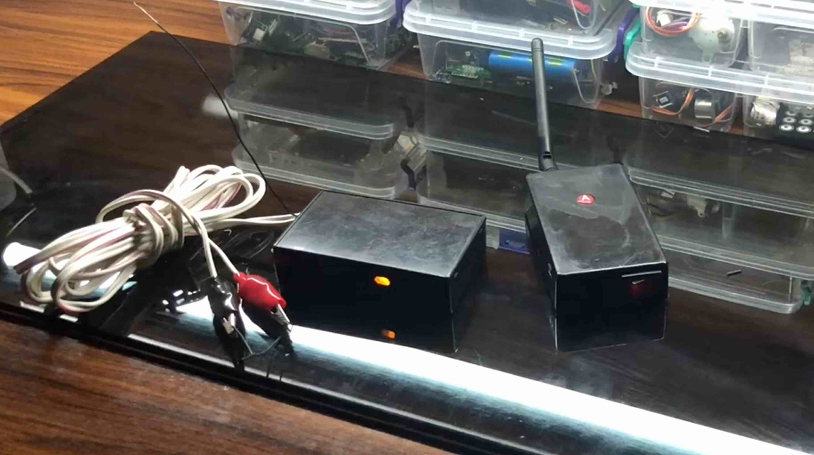
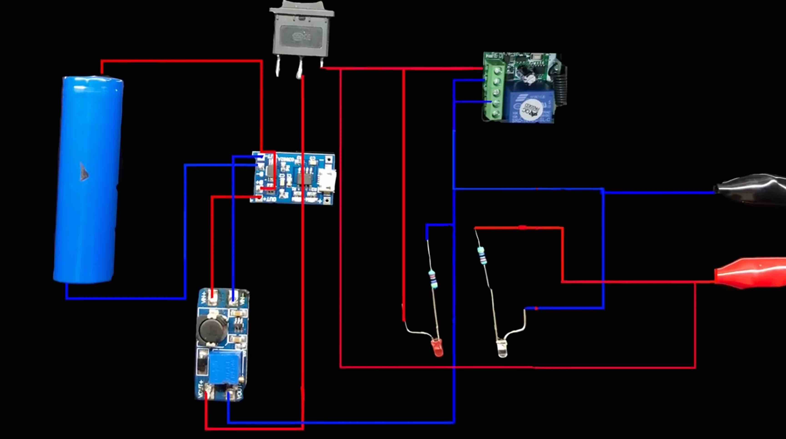
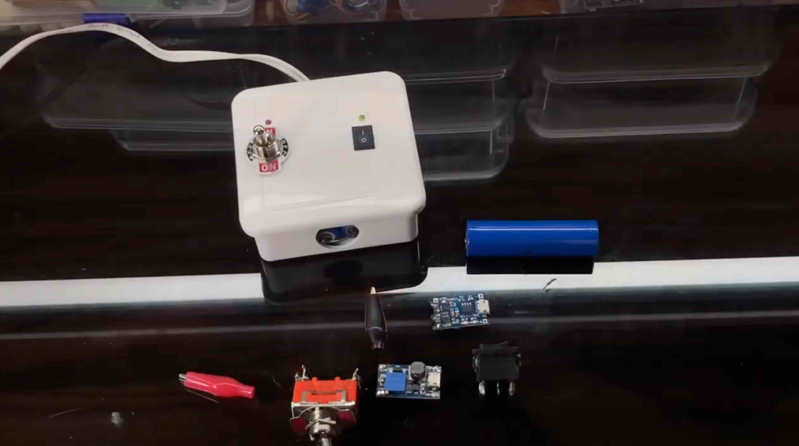

## Building Safe Firework Launchers: Remote and Wired Options

Fireworks have always fascinated me, but safety is paramount when dealing with them. After a relative accidentally blew his fingers out with a firework, I realized just how crucial it is to handle them responsibly. This prompted me to build two types of safe firework launchers: a remote-controlled one using a radio module and a wired one powered by an 18650 battery. This project combined my love for electronics with the thrill of fireworks while ensuring safety throughout the process.

## Designing the Remote-Controlled Firework Launcher

For the remote-controlled launcher, I utilized a radio module to enable wireless operation. This design allows for a safe distance between the operator and the fireworks, reducing the risk of accidents.

### Components Used:

- **Relay based radio module** for remote control
-	**Power supply** to run the system

The radio module communicates with the relay module, which is activated when the button on the remote is pressed. The relay then powers the electric matches, igniting the fireworks.

## Building the Wired Firework Launcher

For the wired version, I took a more straightforward approach. This launcher consists of an 18650 battery, a few switches, and electric matches. It’s simpler but still effective and safe.

### Components Used:

-	**18650 battery** for power
- **Charging module** for a battery 
-	**Tumblers** to control ignition
-	**Electric matches** for firing the fireworks

.gif)

The setup is straightforward: pressing the switch completes the circuit, sending power to the electric matches and igniting the fireworks. The wired design allows for direct control, but I made sure to keep a safe distance while launching.

## Testing the Launchers

Testing was the most exciting part of this project. I conducted several tests for both launchers, ensuring everything functioned as intended. For the remote-controlled launcher, it was thrilling to see the fireworks shoot up from a safe distance, and I made sure to follow all safety protocols during the process.

With the wired launcher, I was able to ignite the fireworks quickly by pressing the switches. Each successful launch felt rewarding, as I knew I had created a safe and reliable way to enjoy fireworks.

.
.gif)

Building these safe firework launchers was an incredibly rewarding experience. Not only did I learn a lot about electronics and safety measures, but I also created a way to enjoy fireworks responsibly. Whether you prefer the convenience of remote control or the straightforwardness of a wired system, both options offer a fun way to celebrate special occasions safely.

If you’re interested in creating your own firework launcher, make sure to prioritize safety in every aspect of the build and operation. Fireworks can be exhilarating, but safety should always come first!