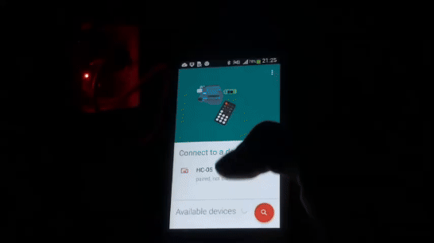
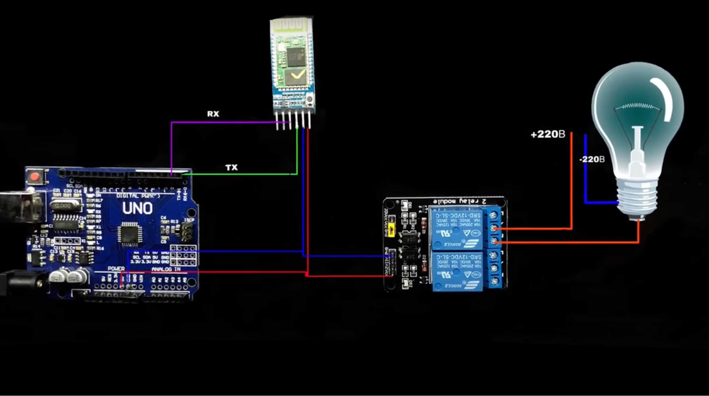

## Automating My Table Light with Arduino and Bluetooth
I’ve always enjoyed the challenge of adding automation to everyday items, so when I decided to automate my table light, I knew Arduino would be the perfect tool to get the job done. This time, I made a Bluetooth-controlled relay module that lets me switch the light on and off using my phone. It was a simple project, but the results were pretty cool!

.

## Components I Used

For this project, I used:

	-	**Arduino Uno** to handle the controls.
	-	A **Bluetooth module** to receive commands from my phone.
	-	A **relay module** to control the power to the table light.
	-	The **Arduino Bluetooth app** to send signals from my phone.

The relay module acts as a switch for the light, and by sending commands through Bluetooth, I could control it wirelessly from my phone, turning it on or off with just a tap.

The basic idea behind this setup is pretty straightforward. I connected the relay module to the table light, allowing it to control the power supply. The Bluetooth module is connected to the Arduino, and the Arduino Bluetooth app on my phone sends commands to the Bluetooth module. When the correct signal is received, the Arduino activates the relay, switching the light on or off.

## Setting It Up

I started by wiring the relay module to the power line of the table light. Since the relay works as an electronic switch, the Arduino controls whether it should let the current through or block it.

Next, I connected the Bluetooth module to the Arduino. I used the Arduino Bluetooth app on my phone, which was a really easy way to send simple on/off commands to the relay.

With the code uploaded to the Arduino, the light was controllable through Bluetooth. It was awesome to be able to switch my table light on and off from across the room without getting up!

.
.gif)

## Extending the Project with a Remote Control

Inspired by how well the Bluetooth system worked, I decided to build another version of this project—but this time, I used a remote control to operate the light. The mechanism is similar: the remote sends a signal to the Arduino, which controls the relay module.

.
.gif)

After assembling everything, I uploaded the code to the Arduino and conducted a test to ensure that the remote control was working properly. The moment I pressed the button and the light turned on was incredibly satisfying!

.
.gif)

Finally, I secured the entire setup to my table and showcased how it operates. It was a fantastic feeling to see my hard work pay off as I effortlessly turned the light on and off with the remote!

.
.gif)

