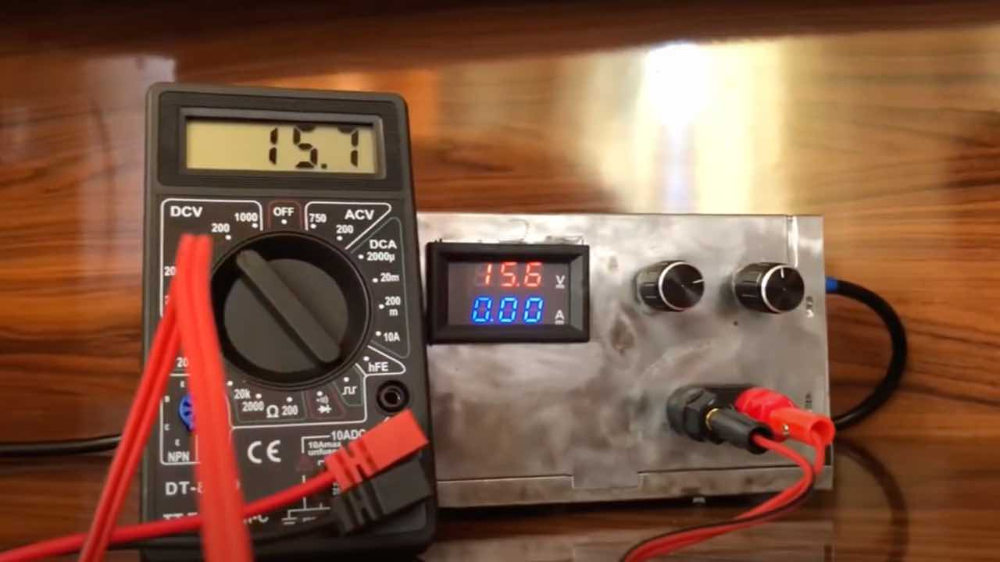
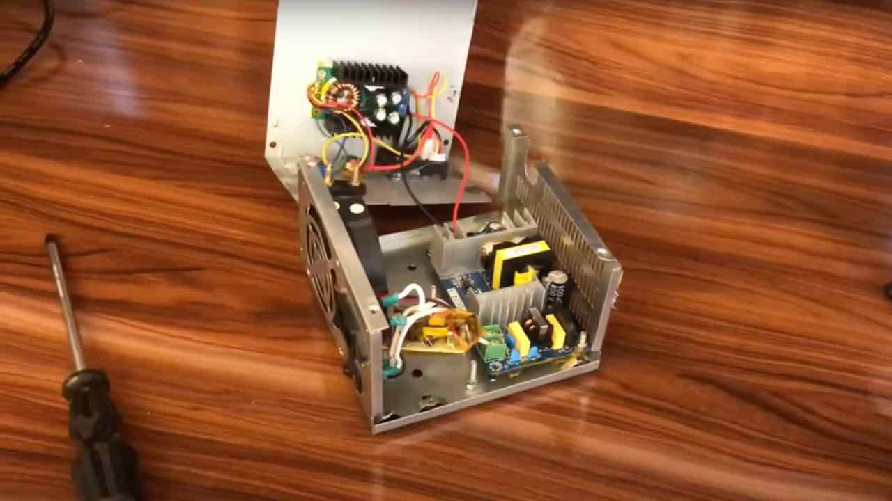
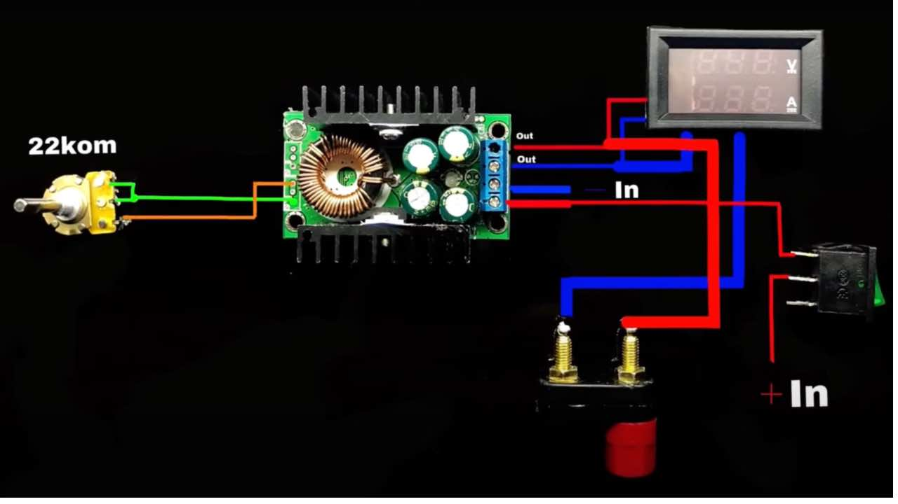
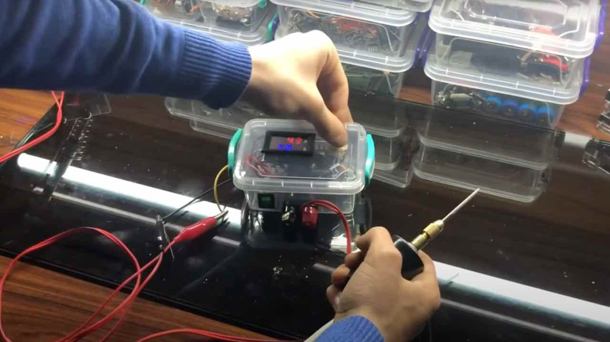

When working on various electronics projects, having reliable and adjustable power sources is crucial. That’s why I decided to build two power supplies that allow me to fine-tune the voltage output for different needs.

## Power Supply 1: From 220V to 1.5V–36V

.

The first power supply I created was designed to convert a standard 220V AC input into an adjustable DC output ranging from **1.5V to 36V**. This allows me to power a wide variety of projects, from low-voltage circuits to higher-powered devices.

### Key Features:

- **Input:** 220V AC
-	**Output:** 1.5V to 36V DC (adjustable)
-	**Usage:** Ideal for general-purpose electronic devices that require stable, controllable power.

The challenge was ensuring the voltage remains stable and safe, even at the lower output ranges. I incorporated precision regulators and safety mechanisms to avoid overheating or excessive current flow.

## Power Supply 2: Regulating Any Input to 1.5V–36V

.

The second power supply was designed to handle **any input voltage** up to 36V, converting it into an adjustable **1.5V to 36V** output. This versatility makes it perfect for projects that don’t have a consistent power source but still require controlled voltage.

### Key Features:

- **Input:** Any voltage up to 36V
-	**Output:** 1.5V to 36V DC (adjustable)
-	**Usage:** Useful for field projects or experiments where the power source varies.

.

## Why Build Your Own Power Supply?

While commercial power supplies are available, building my own gave me the flexibility to tailor the devices to my specific needs. I could adjust the output voltage easily, ensuring I had exactly what each project required without the limitations of preset voltage options.

Plus, it was an excellent learning experience. I delved deep into voltage regulation, heat dissipation, and circuit protection—skills that are invaluable for future electronics work.

These two power supplies have been essential tools in my workshop, enabling me to experiment with various electronics safely and effectively. Whether I’m powering a tiny sensor or a more complex system, the adjustable voltage feature lets me adapt to any situation with ease.

If you’re into DIY electronics and want to have more control over your projects, I highly recommend trying to build your own power supply. It’s a rewarding project that will enhance your future builds!

