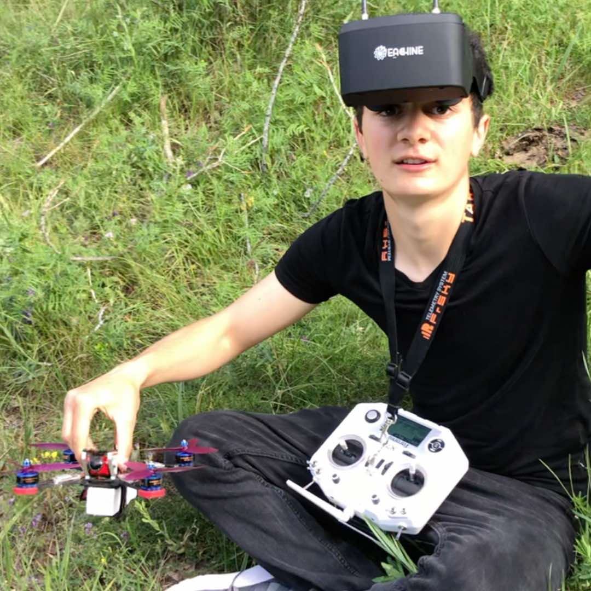

## Building and Flying My First FPV Drone

Back in 2019, I decided to dive into the world of FPV (First-Person View) drones and build one from scratch. It was a fun challenge, but it also taught me a lot about drone technology and how these machines work. I ordered all the parts I needed from China and started putting everything together.

## The Parts That Made It Fly

To get started, I ordered a bunch of essential parts for my drone:

-	**4S LiPo Batteries** (1500mAh, CNHL)
-	**SkyRC iMAX B6 Charger** to keep those batteries charged
-	**Taranis Q7 RC** for controlling the drone
-	**Eachine 800D Goggles** for the FPV experience
-	**Matek F405-CTR Flight Controller** to manage the drone’s movements
-	**Foxeer Camera and video transmitter** to capture and send the live video feed

Once all the parts arrived, I assembled the drone piece by piece. This was my first time building something this complex, but the excitement kept me going. By the end of the build, I had a fully functional FPV drone that I was eager to fly.

## Taking It to the Skies

<iframe width="100%" height="500" src="https://www.youtube.com/embed/qirq7kfMwyk?si=XvwgvOdH7TGGYj1z" title="YouTube video player" frameborder="0" allow="accelerometer; autoplay; clipboard-write; encrypted-media; gyroscope; picture-in-picture; web-share" referrerpolicy="strict-origin-when-cross-origin" allowfullscreen></iframe>

I started flying the drone in 2020. It was an amazing feeling to see something I built with my own hands take off into the sky. Flying FPV was a whole new experience. Wearing the goggles, I could see exactly what the drone was seeing, as if I was in the pilot’s seat.

I flew the drone regularly, testing its limits and learning how to control it better. Unfortunately, after some time, I crashed it. That’s part of the hobby, though—crashes happen, and they teach you what to improve for next time.

## My DJI Phantom Experience

Before building my FPV drone, I had already been flying a DJI Phantom 3 Standard, which I got in 2017. I flew the DJI Phantom from 2017 until 2021. It was my first experience with drones and helped me get comfortable with basic flight controls before diving into FPV.

## UAV Simulator Competition in 2023

In 2023, I participated in a **UAV simulator competition** at the **American University of Armenia (AUA)**. Competing against other drone enthusiasts was both thrilling and challenging. I practiced a lot in the simulator, and by the end of the event, I had made it to the list of **top performers**.

.

After the competition, we took our skills into the real world, flying several drones, including the **Mavic 3 Pro**, **DJI FPV**, and a bunch of **Miniwhoops**. It was an incredible experience to apply what I had learned in the simulator to real drones out in the field.

.
.gif)

## Joining the AUA Drone Club

Currently, I’m a part of the **AUA Drone Club**, where we continue to explore drone technologies and sharpen our flying skills. I’m also excited to be participating in the next batch of the UAV simulation competition. Competing and learning alongside other drone enthusiasts has been an amazing journey.

## What’s Next?

.
.gif)

Building and flying drones has become more than just a hobby for me—it’s a passion. From building my own FPV drone to competing in UAV events, I’ve learned a lot and plan to keep pushing my skills further. Whether it’s flying for fun or exploring new drone technologies, this journey is just getting started!

