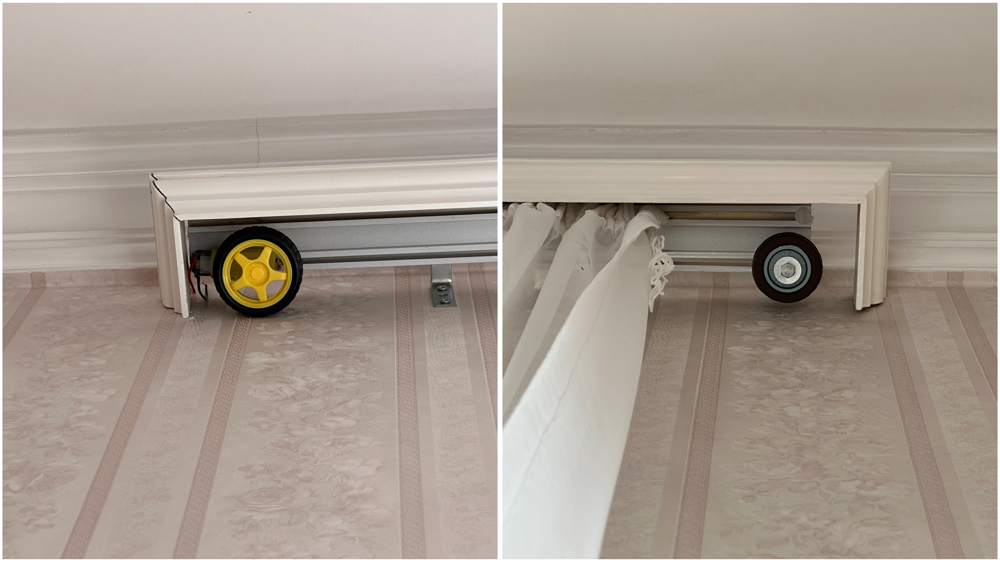
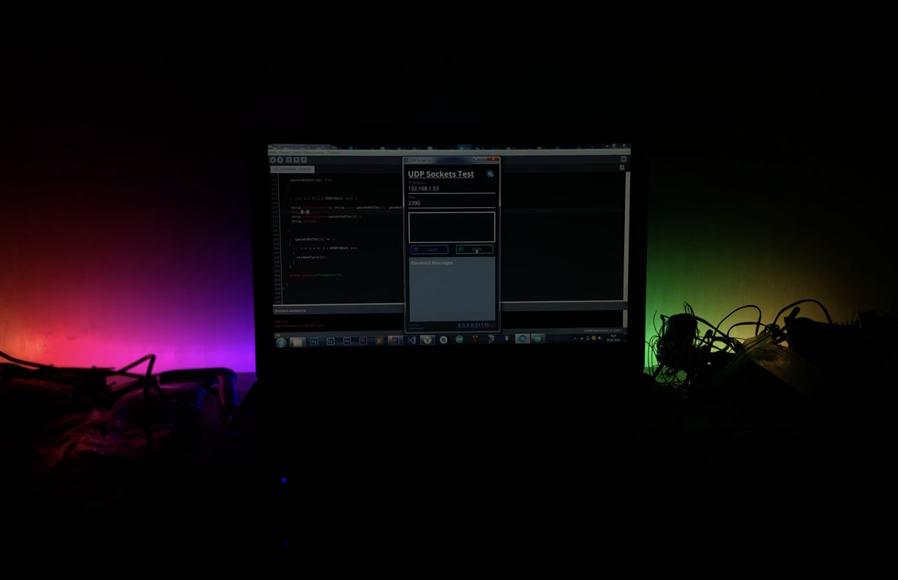

## Creating Smart Home Solutions with Amazon Alexa and ESP32

In this project, I explored the exciting world of smart home technology by using Amazon Alexa and ESP32 modules. My goal was to create solutions that make it easy to control various devices in my home, turning my living space into a more interactive and convenient environment.

## Connecting Devices to Amazon Alexa

<iframe width="100%" height="400" src="https://www.youtube.com/embed/T0VOl6i1NTQ?si=X5OZCYixbn2mBXaT" title="YouTube video player" frameborder="0" allow="accelerometer; autoplay; clipboard-write; encrypted-media; gyroscope; picture-in-picture; web-share" referrerpolicy="strict-origin-when-cross-origin" allowfullscreen></iframe>

To start, I integrated the ESP32 modules with Amazon Alexa. This allowed me to control different devices, like the curtains in my room and the table light, using simple voice commands. For example, I can say, “Alexa, good morning” and the ESP32 takes care of the rest, moving the curtains smoothly.

<iframe width="100%" height="500" src="https://www.youtube.com/embed/nQ9dyZtRP0I?si=GS2xhllPHrBSUEcB" title="YouTube video player" frameborder="0" allow="accelerometer; autoplay; clipboard-write; encrypted-media; gyroscope; picture-in-picture; web-share" referrerpolicy="strict-origin-when-cross-origin" allowfullscreen></iframe>

Setting up the connection was an exciting challenge. I had to write code for the ESP32 that communicates with Alexa. I used a library called [Espalexa](https://github.com/Aircoookie/Espalexa) to pair the ESP module with alexa. Once everything was connected, I could control my devices easily and quickly with just my voice.

.

The mechanism I designed uses two wheels placed at each end of the curtain holder. The left wheel is powered by a motor connected to an ESP32, which is also linked to the home’s Wi-Fi network.

## Remote-Controlled RGB Lights

In addition to controlling curtains and lights, I created remote-controlled RGB lights using another ESP32 module. These lights can change colors and brightness, adding a fun and colorful touch to my living space. To control them, I collaborated with a friend who designed a custom app specifically for this purpose.

<iframe width="100%" height="500" src="https://www.youtube.com/embed/SJ7A9OjeQcs?si=XXAw7Mw3MAhqxLAl" title="YouTube video player" frameborder="0" allow="accelerometer; autoplay; clipboard-write; encrypted-media; gyroscope; picture-in-picture; web-share" referrerpolicy="strict-origin-when-cross-origin" allowfullscreen></iframe>

With the app, I can adjust the color and brightness of the lights right from my phone. This feature makes it easy to set the mood for different occasions, whether I’m hosting a party or just relaxing at home. The app communicates with the ESP32, allowing me to control the lights remotely without any hassle.

<iframe width="100%" height="400" src="https://www.youtube.com/embed/NAmX7Tm-HGA?si=QVdF2JVio5ZBa3sf" title="YouTube video player" frameborder="0" allow="accelerometer; autoplay; clipboard-write; encrypted-media; gyroscope; picture-in-picture; web-share" referrerpolicy="strict-origin-when-cross-origin" allowfullscreen></iframe>

## Making My Space Interactive

By combining these technologies, I’ve transformed my home into a vibrant and interactive space. Being able to control devices with my voice or a smartphone app adds a level of convenience that makes everyday tasks easier. I love how I can set the mood in my room with a few taps on my phone or a simple voice command.

Links:
 - [Curtain source code](https://github.com/surenpoghosian/surenpoghosian/tree/main/Curtain)
 - [ESP Wifi setup source code](https://github.com/surenpoghosian/surenpoghosian/blob/main/Alexa-Controlled-Appliances--master/Controlling_W_O_Internet/Controlling_W_O_Internet.ino)
 - [Table source code](https://github.com/surenpoghosian/surenpoghosian/blob/main/Table_Success_/Table_Success_.ino)
 