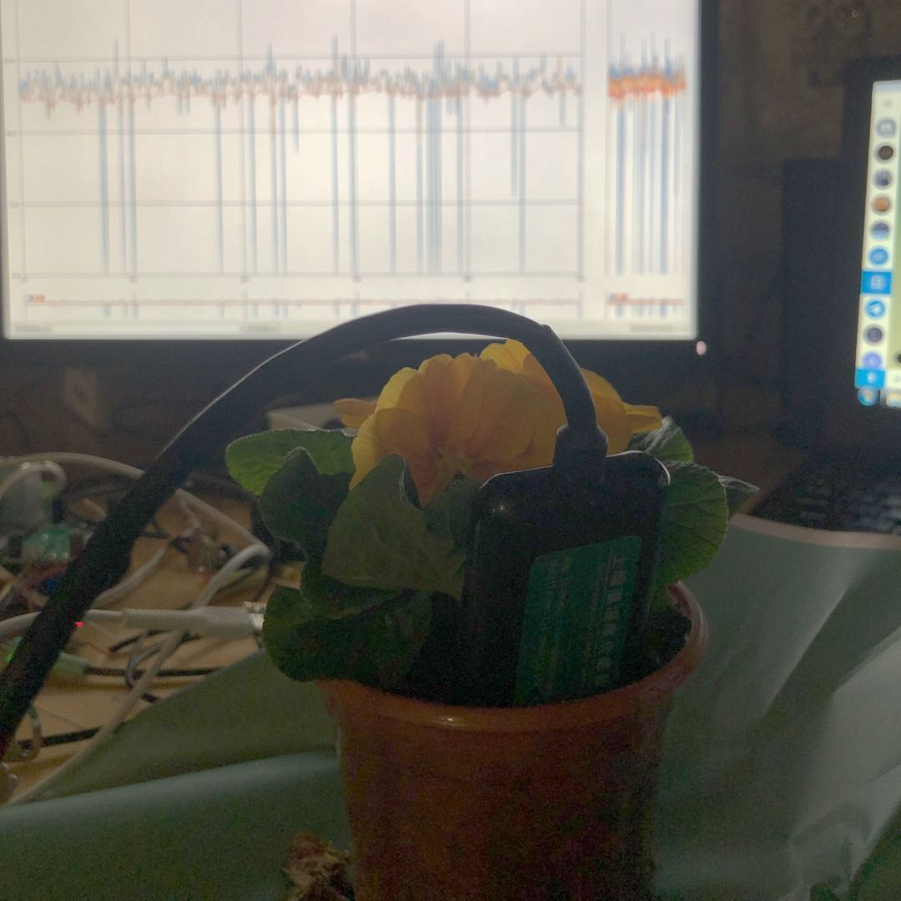
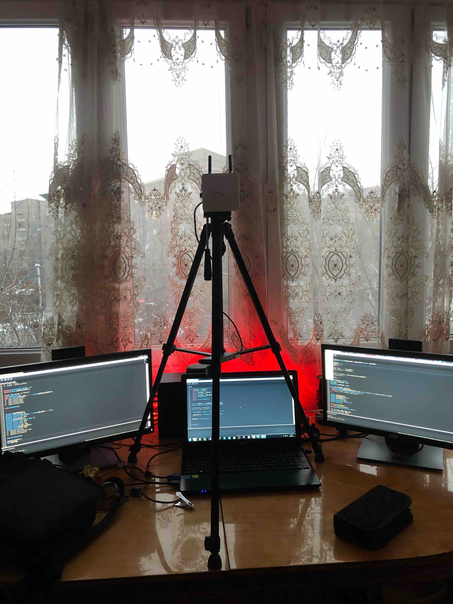
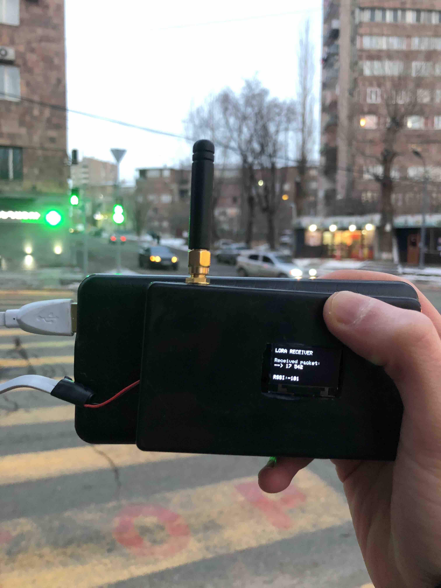
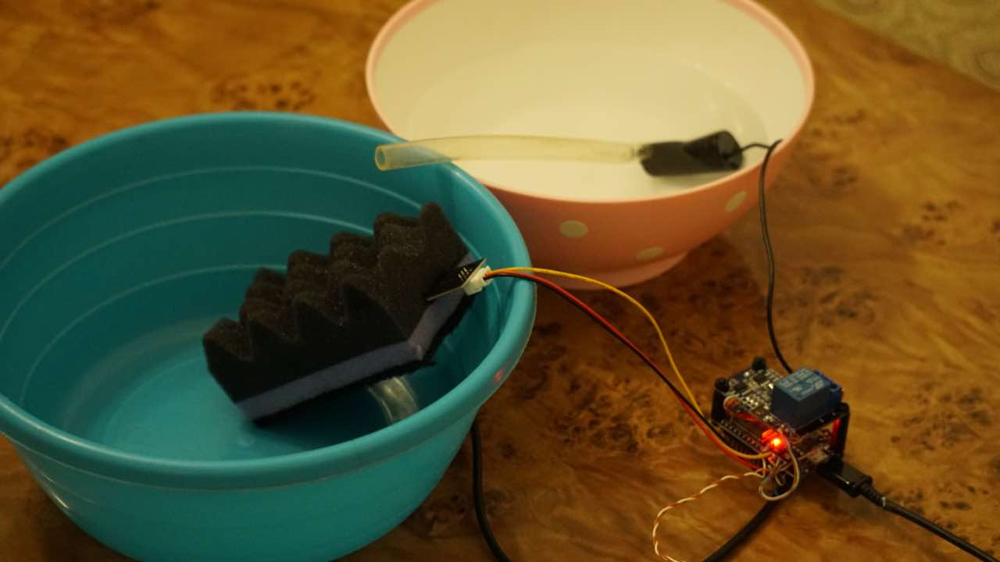

.

For this project, I built a network-attached watering system using ESP32 and LoRa to collect soil data with advanced sensors. The devices communicate with each other and send information to a master device. This master device then forwards the data to a server, where it is saved in a database. To make it easy to monitor, I set up a Telegram bot for each user so they can check the soil conditions directly from their phone.

## How the System Works

I connected ESP32 boards to soil moisture sensors, and they send data through LoRa modules (which have a long-range signal) to a master device. The master device collects all the data and sends it to a server. From there, the data is stored in a database and displayed on a Telegram bot, which users can check to see the current soil moisture levels.

### Main Parts of the System:

-	**ESP32 with embedded LoRa** for processing data modules and it over long distances
-	**Soil moisture sensors** to collect data
-	**Master device** to gather the data
-	**Server** to save the information
-	**Telegram bot** for users to view the data

## Testing LoRa: Checking How Far It Can Go

One of the biggest challenges in this project was testing how far the LoRa signal could reach. LoRa is great for long-range communication, but I wanted to see how far it could go in different areas. In open fields, the signal was strong and worked over several kilometers. In places with trees or buildings, the range was shorter but still good enough for most uses, especially for monitoring large fields or gardens.

This test helped me understand the limits of LoRa, and I was happy to see that it worked well even in tough conditions.

## Testing the Watering Mechanism

To test the watering system, I connected it to a water pump and used a sponge as the test soil. The soil sensor was inserted into the sponge to measure its moisture level, simulating real soil conditions. When the sponge became too dry, the system automatically activated the water pump to start watering.

This experiment showed how well the system could manage watering based on the sensor’s data. The soil sensor provided accurate readings, and the water pump only turned on when necessary, making the whole process efficient and controlled.

## Using Telegram Bots for Easy Monitoring

Once the data was being collected, I needed a simple way for users to access it. I set up Telegram bots so that users could receive real-time updates about their soil. The bot would notify users when the soil needed watering, making it easy for them to monitor the fields without needing a special app.

With a few taps on their phone, users could check moisture levels, get alerts, and even control the watering system based on the data collected.

## Conclusion

This project was a fun and rewarding challenge. By combining ESP32, LoRa, and sensors, I created a system that helps people monitor soil conditions easily. The low-power LoRa modules allowed long-distance communication, and the Telegram bots made it simple to access data in real time.

Building this network-attached watering system showed me how useful IoT (Internet of Things) devices can be in managing fields and gardens. If you’re interested in creating smart systems for monitoring and automation, I recommend trying out ESP32 and LoRa for your next project!

