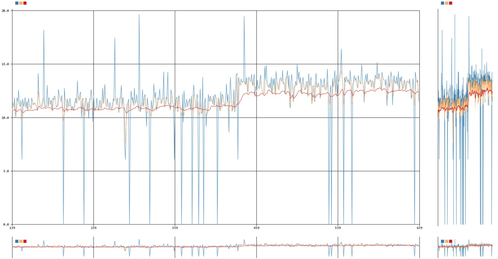

.

In my journey of working with data, one of the challenges I faced was dealing with fluctuations in temperature and humidity readings. These spikes can make it difficult to draw accurate conclusions from the data. To tackle this issue, I focused on implementing effective methods for data correlation smoothing.

## Understanding the Problem

When collecting data from sensors, it’s common to encounter irregularities or sudden spikes in readings. These can be caused by various factors, such as sensor noise, environmental changes, or brief malfunctions. If left untreated, these anomalies can skew the results and lead to incorrect analyses or decisions. Therefore, finding a way to smooth out these data correlations is crucial for reliable insights.

## Techniques for Smoothing Data

One of the most effective techniques I used is the moving average, also known as the rolling average. This method helps to reduce noise in the data by averaging each data point with its neighboring values. Here’s how it works:

-	Collect Data: First, I gathered the temperature and humidity readings over a specific time period.
-	Select a Window Size: I then chose a window size, which determines how many neighboring data points to include in the average calculation. A larger window size smooths the data more, but it may also reduce the responsiveness to changes.
-	Calculate the Average: For each data point, I calculated the average of the values within the window. This means that the spikes are diluted by the surrounding data, resulting in a more stable representation of the readings.

For example, if I had a temperature reading that spiked unexpectedly, the moving average would take into account the values before and after that spike. This averaging process creates a more reliable trend that can be used for further analysis.

## Benefits of Data Smoothing

Using the moving average method provided several advantages:

-	Improved Stability: By smoothing out spikes, the data becomes more stable, making it easier to identify true trends and patterns.
-	Enhanced Analysis: With clearer data, I could perform more accurate analyses, allowing for better decision-making based on the insights gained.
-	Reduced Noise Impact: The impact of sensor noise and anomalies was significantly reduced, leading to more trustworthy results.

## Conclusion

Implementing data correlation smoothing techniques like the moving average has greatly improved my ability to analyze temperature and humidity readings. By reducing the influence of spikes, I can focus on the underlying trends and make more informed decisions based on reliable data.

If you’re dealing with similar challenges in your data collection and analysis projects, I highly recommend exploring data smoothing techniques. They can help you achieve clarity and ensure that your insights are based on accurate and stable data.

