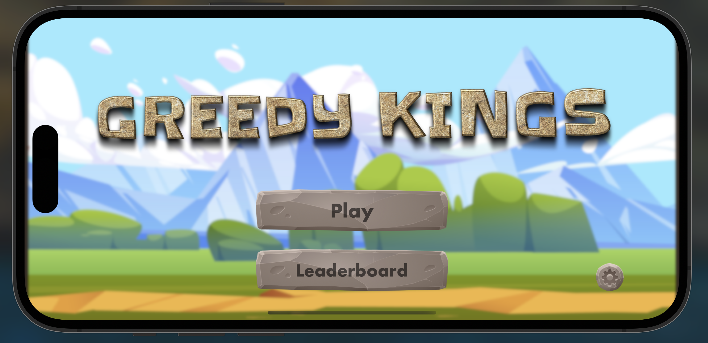
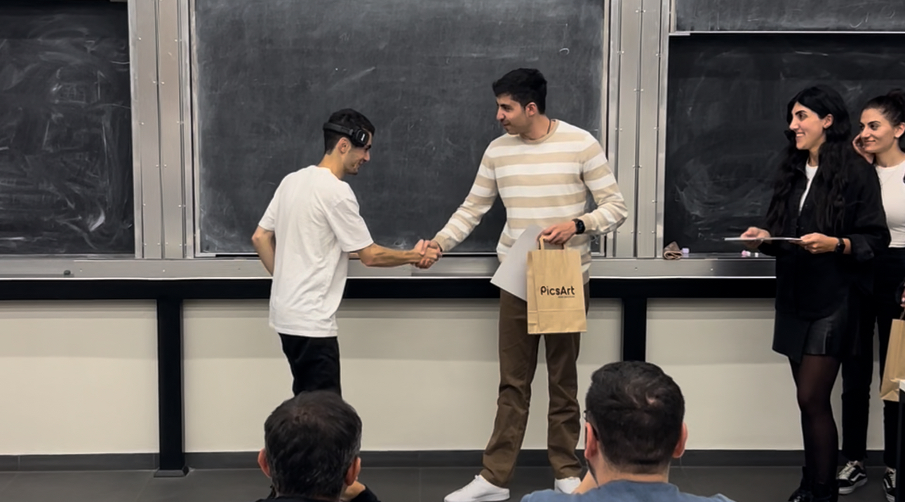
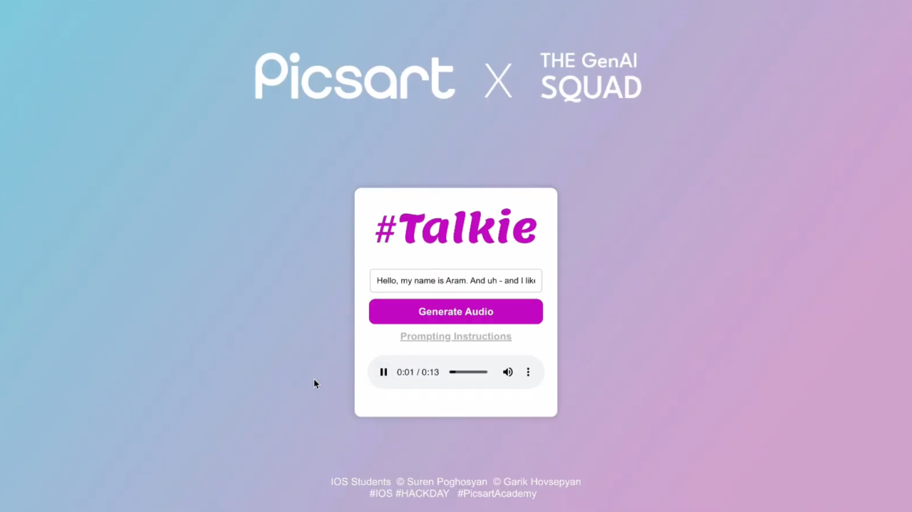
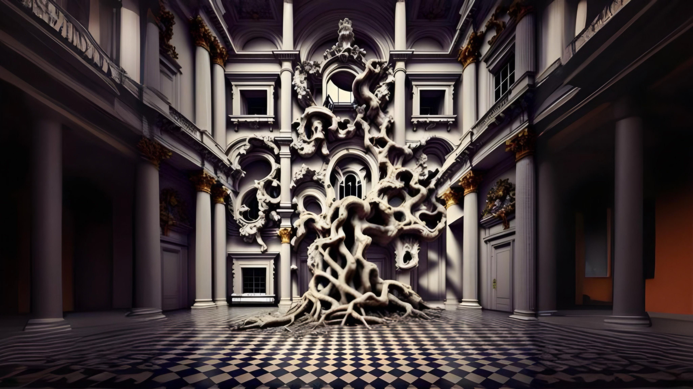
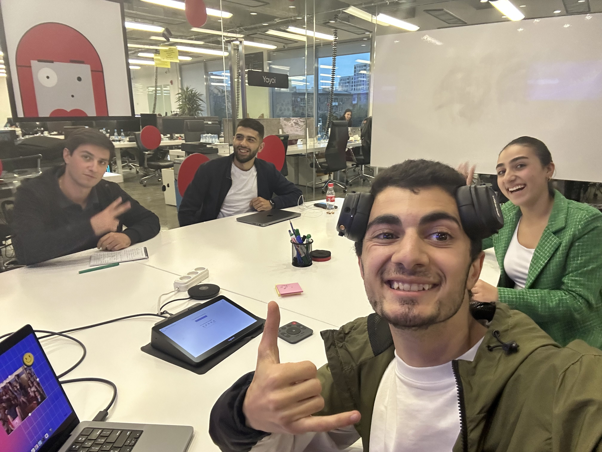

In this post, I want to talk about three software projects I’ve worked on: “Greedy Kings,” “Talkie,” and “Magic QR.” Each of them was a learning experience for me, and I was lucky enough to work on these projects during my time at Picsart, alongside some talented people. These projects also gave me the chance to push myself and try out different things in coding.

## Greedy Kings: A Strategy Game

.

[Greedy Kings](https://apps.apple.com/id/app/greedy-kings-origin/id6474153745) was a game I built for iOS as part of my graduation project for Picsart Academy. It’s an offline turn-based strategy game where each player takes on the role of a king in a castle. The castles are positioned on opposite sides of the screen, and each king has a cannon to shoot at the other’s castle. Players take turns aiming and firing their cannons, trying to outsmart their opponent by making strategic moves. What made this project special for me was the teamwork. Garik Hovsepyan, who was also a student at the academy, worked with me on it. Together, we created a game that was not only fun to play but also challenging to build.

<iframe width="100%" height="500" src="https://www.youtube.com/embed/o1gaD9LmCrU?si=KdN2pv6C7XtX8_yH" title="YouTube video player" frameborder="0" allow="accelerometer; autoplay; clipboard-write; encrypted-media; gyroscope; picture-in-picture; web-share" referrerpolicy="strict-origin-when-cross-origin" allowfullscreen></iframe>

We made this video in a rush, I would change a lot of things in it, and make it more harmonic and smooth, but it is what it is, we wanted to have a contrast among others instead of showing powerpoint slides, and we sure did !

.

At the end of the program, “Greedy Kings” was recognized as one of the top two projects out of 15, which was a big deal for us. It felt great to see our hard work pay off, and I learned a lot about game development, teamwork, and problem-solving during this project.

## Talkie: Turning Text into Speech

.

The next project, [Talkie](https://github.com/surenpoghosian/TalkieFrontEnd) was a completely different experience. Garik and I teamed up again, but this time it was for **Picsart’s hackday**. We wanted to create something quick but useful, so we decided on an app that turns text into speech. It was a pretty simple concept, but we wanted to make it work smoothly and be easy to use.

<iframe width="100%" height="500" src="https://www.youtube.com/embed/GxTYdv1SYeE?si=A3EhKTzru_WdLHER" title="YouTube video player" frameborder="0" allow="accelerometer; autoplay; clipboard-write; encrypted-media; gyroscope; picture-in-picture; web-share" referrerpolicy="strict-origin-when-cross-origin" allowfullscreen></iframe>

We used React for the frontend, and the idea was that users could type any text, and the app would read it out loud. This project was a lot of fun to work on, especially under the time pressure of a hackathon. In the end, “Talkie” was recognized as the best project from the academy, which was another great achievement for us. I learned how quickly ideas can come together when you’re working with the right people and under a tight deadline.

<iframe width="100%" height="500" src="https://www.youtube.com/embed/98J6eZGUs8A?si=U5djkShbicPy0GF1" title="YouTube video player" frameborder="0" allow="accelerometer; autoplay; clipboard-write; encrypted-media; gyroscope; picture-in-picture; web-share" referrerpolicy="strict-origin-when-cross-origin" allowfullscreen></iframe>

## Magic QR: AI-Powered QR Codes

.

[Magic QR](https://github.com/surenpoghosian/MagicQR) was another project I’m really proud of, but this one was more complex than the others. By this time, Garik and I had joined Picsart as employees, and we worked on this app with two more teammates, Rafayel and Anzhela. The goal was to create an iOS app that generates QR codes that are embedded within images using AI.

.

Basically, instead of a boring black-and-white QR code, users could create a QR code that was part of a picture, making it both functional and visually appealing. We spent a lot of time on the AI side of things, ensuring the QR codes were scannable while still looking good. This project was presented to the CEO and CTO of Picsart, which was a huge deal for us as a team. It was a great mix of creativity and technical challenges, and working on it taught me a lot about teamwork, AI integration, and pushing an idea beyond its basic form.

## Thoughts

Each of these projects has been a stepping stone in my journey as a developer. These projects allowed me to explore different areas of coding and work with great people. Every project had its own challenges, but in the end, I was able to create something I’m proud of.