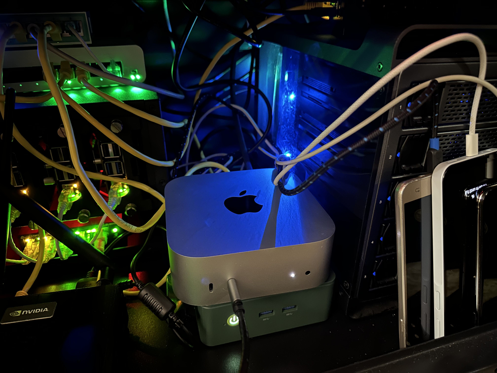

When I started working on a project that needed a lot of app testing, I knew I had to build a reliable setup that didn’t require a fancy lab or super expensive gadgets. I wanted something practical and easy to manage—and that’s exactly what I built!

Here’s a little overview of how I made it work.

### Why I Chose Appium

Testing apps can get tricky because there are so many devices and platforms out there. I needed something flexible, and Appium was the perfect fit. It’s open-source (so no cost!), works for Android, iOS, and web apps, and it’s surprisingly simple once you get the hang of it.

But Appium was just one part of my setup. Let me walk you through the rest!

### My Hardware Setup

I wanted my setup to cover both iOS and Android, so I picked devices that were already available or easy to get:
-	**Mac Mini M4**: This is the heart of my setup. It’s great for building iOS apps and running simulators.
-	**iPhone X**: My go-to device for real-world iOS testing.
-	**Samsung Galaxy J7**: This trusty Android device helps me test apps on older Android versions.
-	**Samsung Galaxy A15**: A newer Android phone for testing modern features and performance.

This combination gives me a good mix of old and new, iOS and Android.

### How It All Came Together

Once the hardware was set, I focused on making the software work. Appium runs as a server that controls your app tests. I connected all the devices to my Mac Mini via cables or a local network. With Appium installed and my devices set up, I could start running tests in no time.

Of course, there were some hiccups along the way, like configuring the iOS simulators or dealing with older Android system versions, but I figured it out step by step.

### What I Learned

Building this setup wasn’t just about testing apps—it also taught me a few useful lessons:
-	Testing on a mix of devices (new and old) is super helpful to make sure your app works for everyone.
-	Appium is flexible, free, and works across so many platforms.
-	Mac Mini is a Beast, it handles iOS builds, simulators, and Appium tasks with ease.

### Looking Ahead

I’m pretty happy with how this setup turned out. It’s simple, easy to manage, and does exactly what I need. As I keep testing more apps, I’ll probably tweak and improve it, but for now, it’s working great!

If you’re thinking about setting up your own app testing environment, just start with what you have. It doesn’t have to be perfect to be effective.

Helpful Links:

- [Learn About Appium](http://appium.io/docs/en/latest/)
- [Explore the Mac Mini](https://www.apple.com/mac-mini/)
