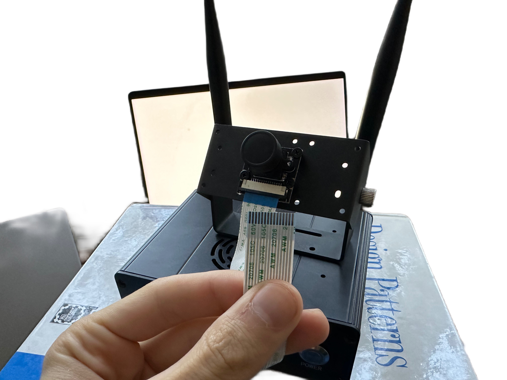
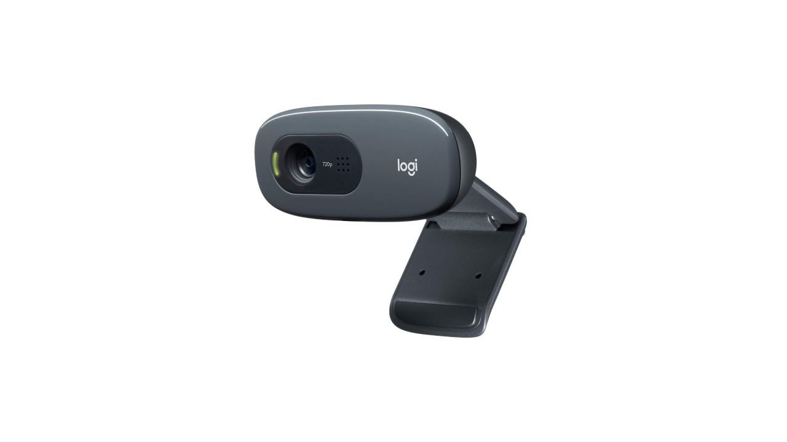

Links:

- [Jetson orin nano 8gb](https://www.amazon.com/dp/B0BZJTQ5YP?ref=ppx_yo2ov_dt_b_fed_asin_title&th=1)
- [Camera](https://www.amazon.com/dp/B07T43K7LC?ref=ppx_yo2ov_dt_b_fed_asin_title)
- [Case](https://www.amazon.com/dp/B0CG38BS5S?ref=ppx_yo2ov_dt_b_fed_asin_title)
- [Wifi module](https://www.amazon.com/dp/B07SGDRG34?ref=ppx_yo2ov_dt_b_fed_asin_title)
- [M2 ssd](https://www.amazon.com/dp/B0DBR9RZLV?ref=ppx_yo2ov_dt_b_fed_asin_title&th=1)
- [Logitech C270](https://www.amazon.com/Logitech-Desktop-Widescreen-Calling-Recording/dp/B004FHO5Y6/ref=sr_1_3?crid=28RVDROT3XZU6&dib=eyJ2IjoiMSJ9.dWLnishmnhzeI4z58p0Q0eOB0vAW5crj4jbTAOzzisQR8QSze5Xk9IZ4YJz2mSLArPAv59FH-nViCQQr8CVEtKAAk7CksRblj9eIAi806Qb_N4R9l01hGw73l_rZYz1QWxh5aCWIBrstRWi9144mD0w8BCJJUY24LPZC3mRXjfa1cdnCcIZIVqfrjgIbMfgTZWy-nua7330KNen2uyCo39kcwEaQY0g5CPaE5Kg0t5E.jH9-mA2g5W8LeB4jPze6hMAYKGaJnS9nR9gN7CFtcac&dib_tag=se&keywords=logitech+c270+hd+webcam&qid=1729434490&sprefix=C270%2Caps%2C233&sr=8-3)