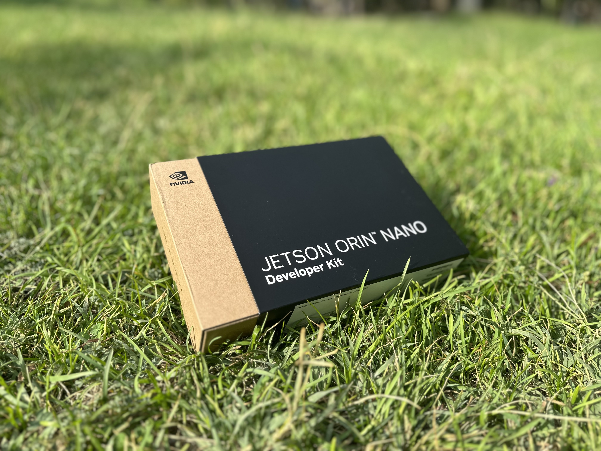
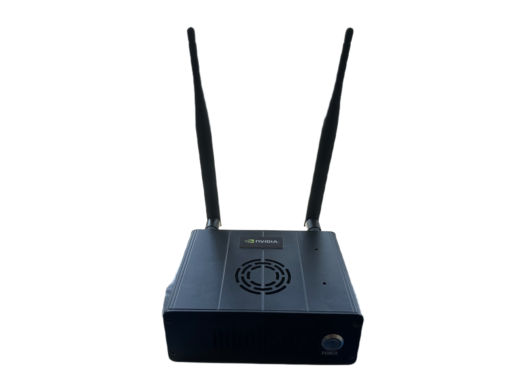
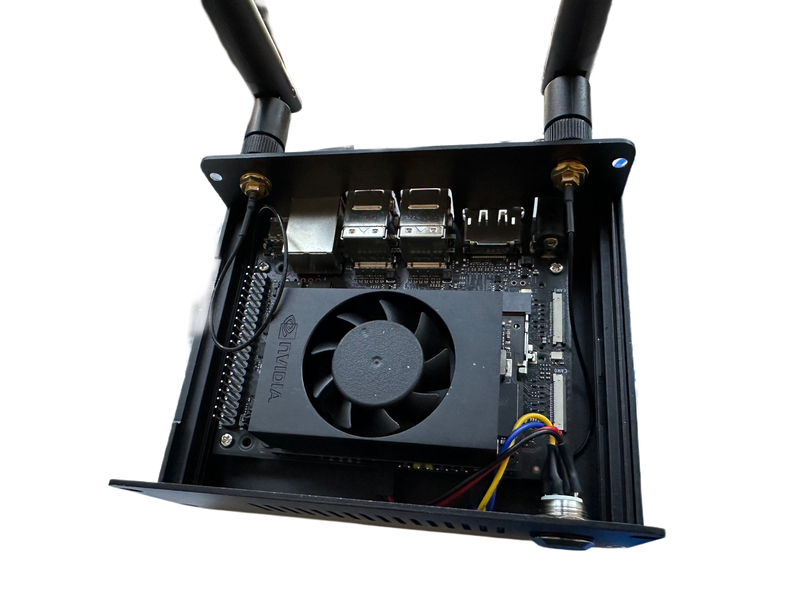
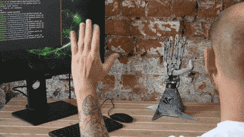
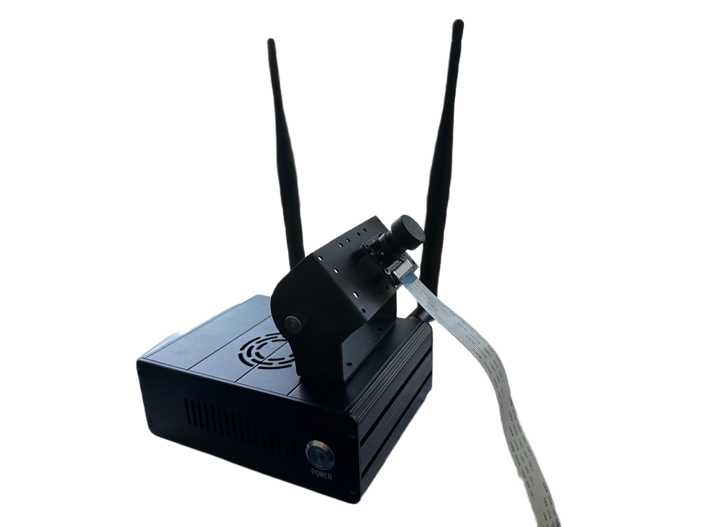

In this post, I’ll walk you through my initial experience diving into the world of computer vision using the Jetson Orin Nano. My goal with this project was to leverage the Jetson’s power for real-time analysis at the edge, experimenting with AI in a compact, flexible setup. Along the way, I faced some challenges and learned a lot about setting up the hardware and configuring the software, so I’ll share that process and a bit about the potential for computer vision with the Orin Nano.

## Why the Jetson Orin Nano?

The Jetson Orin Nano is specifically designed for edge AI applications, meaning it brings advanced computing power to small devices. For computer vision tasks—where real-time image processing is key—this makes it an ideal choice. With its powerful GPU and support for AI frameworks, it allows developers to run machine learning models on the edge without relying on cloud services, making it faster and more efficient.

I wanted to explore these capabilities by setting up a system where the Orin Nano could handle tasks like object detection, face recognition, and other forms of real-time analysis. While I’m still in the early stages of the project, the setup process was a valuable learning experience in itself.

## The Hardware Setup

For this project, I needed a few key components:

-	**Logitech C270 Camera**: Initially, I ordered a camera module that didn’t work with the Orin Nano. So, I switched to a reliable USB Logitech C270 camera, which worked out well.
-	**Kingston M2 500GB SSD**: I added this for extra storage, since I planned to work with larger datasets and needed fast access times.
-	**Jetson Orin Nano Case**: A case to protect the board and help with cooling.
-	**Wi-Fi Module**: I ordered this, but later found that the Orin Nano already had built-in Wi-Fi, so it wasn’t necessary.

Once I had the hardware ready, it was time to set up the software and get the Jetson Orin Nano running.

## Software Setup Challenges

My first step was trying to install [JetPack 6.1](https://developer.nvidia.com/embedded/jetpack), which is NVIDIA’s software package for Jetson devices. JetPack comes with all the necessary tools to run AI applications, including libraries for computer vision, deep learning, and hardware acceleration.

I tried to flash the software onto an SD card, but ran into an issue where the Orin Nano wouldn’t boot properly. After some troubleshooting, I realized I needed to use [NVIDIA’s SDK Manager](https://developer.nvidia.com/sdk-manager) to set it up correctly.

Initially, I attempted to run SDK Manager on a PC with Ubuntu 24, but unfortunately, SDK Manager doesn’t support that version yet. After downgrading to Ubuntu 22, I managed to install the SDK Manager successfully. With the right setup, I was finally able to flash the Jetson Orin Nano and get it running with JetPack.

For anyone going through a similar process, be prepared for some trial and error. NVIDIA’s official resources, while comprehensive, can sometimes be tricky to navigate. If you’re using the **SDK Manager** or setting up the **Jetson Orin Nano Devkit**, make sure to take your time and follow the steps carefully. I found it helpful to cross-reference different sections of their documentation, but some parts might still feel a bit disorganized. You can check out the [SDK Manager documentation](https://developer.nvidia.com/sdk-manager) for the latest instructions and use their [Getting Started with Jetson Orin Nano Devkit](https://developer.nvidia.com/embedded/learn/get-started-jetson-orin-nano-devkit) guide, though be ready to troubleshoot along the way.

## Computer Vision with Jetson Orin Nano

While I haven’t fully explored the computer vision side yet, I’m excited about the potential of using the Jetson Orin Nano for real-time image analysis. Computer vision tasks typically require a lot of processing power, especially when working with neural networks or deep learning models. The Jetson Orin Nano is specifically designed to handle this efficiently, right at the edge of the network.

[Robot Nano Hand](https://developer.nvidia.com/embedded/community/jetson-projects/nv_trt_pose)

Some common use cases for computer vision with the Jetson include:

-	**Object Detection**: The Orin Nano can be used to identify and track objects in real-time, making it useful for applications like security cameras, traffic monitoring, or industrial automation.
-	**Facial Recognition**: Using pre-trained models, the Jetson Orin Nano can recognize and distinguish faces, which can be applied to access control systems, customer analytics, or personalized user experiences.
-	**Gesture Recognition**: By processing video feeds, the Jetson can interpret hand or body movements, enabling interactive AI applications.

[Real-time Human Pose Estimation](https://developer.nvidia.com/embedded/community/jetson-projects/nv_trt_pose)
 

The real-time capability of the Orin Nano is what makes it stand out for computer vision tasks. Unlike cloud-based systems that introduce latency, edge devices like this one can process data locally, making responses faster and reducing bandwidth use.

## Advice and Lessons Learned

Here are some tips if you’re looking to explore computer vision or similar projects with the Jetson Orin Nano:

1.	**Get the right camera**: Make sure the camera you choose is compatible with the Jetson Orin Nano. In my case, I had to switch to a USB camera after my first choice didn’t work.
2.	**Ensure correct software versions**: As I learned the hard way, SDK Manager doesn’t support all Ubuntu versions. Stick to Ubuntu 22 for a smoother installation process.
3.	**Use SSD storage**: For real-time analysis, fast storage is a must. The Kingston M2 SSD I added provided the speed and space needed for handling larger models and datasets.
4.	**Leverage NVIDIA resources**: NVIDIA provides great tools and documentation to guide you through setting up the Jetson. Their Getting Started with Jetson Orin Nano Devkit guide was particularly useful.

## Conclusion

While I’m still in the early stages of this project, the Jetson Orin Nano has already proven to be a powerful tool for exploring AI at the edge. I’m looking forward to diving deeper into computer vision and seeing how far I can push the capabilities of this compact device. If you’re interested in working with real-time AI or edge computing, I highly recommend giving the Jetson Orin Nano a try.

Parts:

- [Jetson orin nano 8gb](https://www.amazon.com/dp/B0BZJTQ5YP?ref=ppx_yo2ov_dt_b_fed_asin_title&th=1)
- [Camera](https://www.amazon.com/dp/B07T43K7LC?ref=ppx_yo2ov_dt_b_fed_asin_title)
- [Case](https://www.amazon.com/dp/B0CG38BS5S?ref=ppx_yo2ov_dt_b_fed_asin_title)
- [Wifi module](https://www.amazon.com/dp/B07SGDRG34?ref=ppx_yo2ov_dt_b_fed_asin_title)
- [M2 ssd](https://www.amazon.com/dp/B0DBR9RZLV?ref=ppx_yo2ov_dt_b_fed_asin_title&th=1)
- [Logitech C270](https://www.amazon.com/Logitech-Desktop-Widescreen-Calling-Recording/dp/B004FHO5Y6/ref=sr_1_3?crid=28RVDROT3XZU6&dib=eyJ2IjoiMSJ9.dWLnishmnhzeI4z58p0Q0eOB0vAW5crj4jbTAOzzisQR8QSze5Xk9IZ4YJz2mSLArPAv59FH-nViCQQr8CVEtKAAk7CksRblj9eIAi806Qb_N4R9l01hGw73l_rZYz1QWxh5aCWIBrstRWi9144mD0w8BCJJUY24LPZC3mRXjfa1cdnCcIZIVqfrjgIbMfgTZWy-nua7330KNen2uyCo39kcwEaQY0g5CPaE5Kg0t5E.jH9-mA2g5W8LeB4jPze6hMAYKGaJnS9nR9gN7CFtcac&dib_tag=se&keywords=logitech+c270+hd+webcam&qid=1729434490&sprefix=C270%2Caps%2C233&sr=8-3)

Resources:

- [Nvidia SDK Manager](https://developer.nvidia.com/sdk-manager)
- [Get started with Jetson orin nano](https://developer.nvidia.com/embedded/learn/get-started-jetson-orin-nano-devkit)
- [Jetpack SDK (Jetson Linux)](https://developer.nvidia.com/embedded/jetpack)
- [Jetson Community Projects](https://developer.nvidia.com/embedded/community/jetson-projects)
- [Jetson Resources](https://developer.nvidia.com/embedded-computing)
