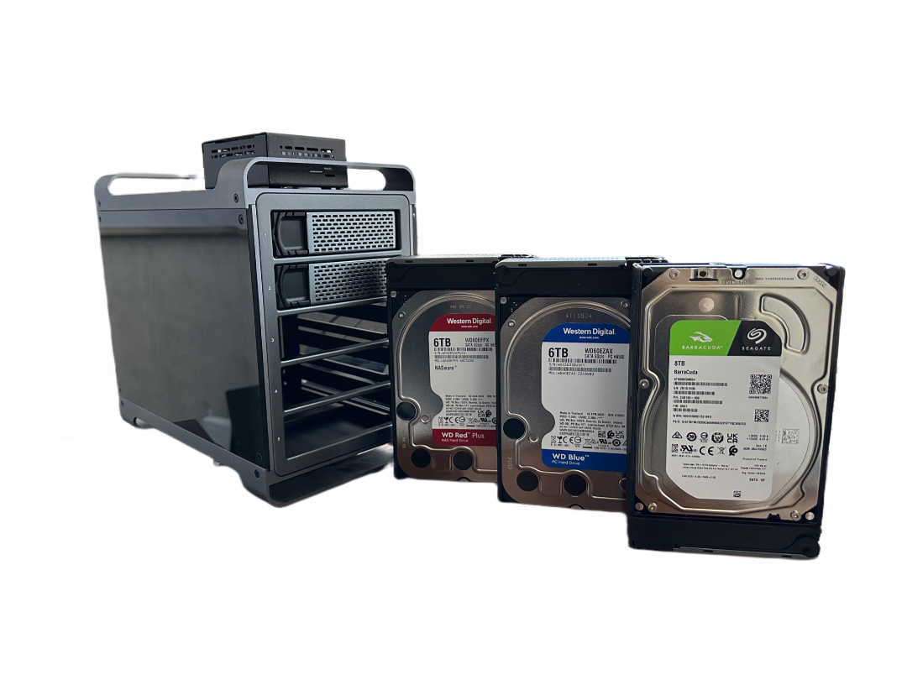
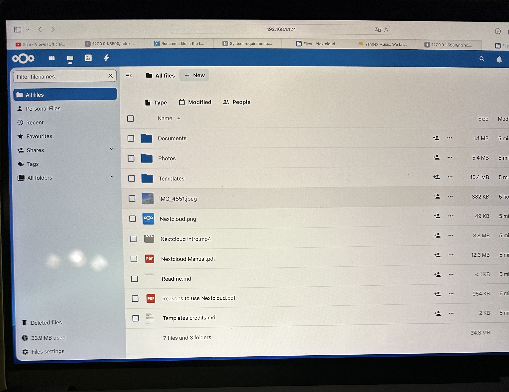

Imagine having your own private cloud storage—like Google Drive or Dropbox—but without monthly fees, data limits, or privacy concerns. That’s exactly what I built using a Raspberry Pi, some hard drives, and Nextcloud, a powerful open-source tool that turns your hardware into a personal, accessible-from-anywhere cloud solution.

## Why Make a Personal Cloud Storage?

Services like Google Drive, Dropbox, and iCloud are super convenient for storing photos, documents, and more. But they come with some limitations:

- **Monthly Fees**: Extra storage often means paying for a monthly or annual subscription.
-	**Privacy Concerns**: Your files are stored on someone else’s servers, which may raise concerns about data security and access.

With a personal cloud setup, I don’t pay any monthly fees, and I have complete control over where my files are stored and who can access them.

## What I Used

Here are the main components I used for this project:

-	**Raspberry Pi 5 (8GB RAM)** - Running Ubuntu 24 LTS Server.
-	**5-bay HDD enclosure** - This is where I connected my hard drives.
-	**Three hard drives** – A 6TB Western Digital Red, a 6TB Western Digital Blue, and an 8TB Seagate, giving me a total of 20TB of storage.
-	**Docker and Docker Compose** – To simplify the deployment of Nextcloud and the required services.
-	**Nginx** – As a reverse proxy for handling web traffic.

### Why Docker and Docker Compose?

Using Docker allowed me to isolate all the services (Nextcloud, the database, etc.) in containers, making them easier to manage and deploy. With Docker Compose, I was able to define and start the entire setup with one command by simply configuring the **docker-compose.yml** file. This setup also makes it easier to update or migrate in the future.


## Setting Up the Raspberry Pi

I started by installing Ubuntu 24 LTS Server on the Raspberry Pi. I flashed the Ubuntu image onto an SD card using Balena Etcher and booted up the Raspberry Pi. Once connected to my network, I accessed the Pi using SSH from my main computer.

After logging in, I updated the system:

```bash
sudo apt update && sudo apt upgrade
```

## Installing Docker and Docker Compose

To simplify the deployment of Nextcloud, I installed Docker and Docker Compose on the Raspberry Pi:

```bash
sudo apt install docker.io
sudo apt install docker-compose
```

Also make sure the Docker service was running:

```bash
sudo systemctl start docker
sudo systemctl enable docker
```

## Mounting the Hard Drives

I connected the 5-bay HDD enclosure via USB to the Raspberry Pi, which held the three hard drives (6TB WD Red, 6TB WD Blue, and 8TB Seagate). After connecting, I mounted them manually using the following steps:

```bash
sudo mkdir /mnt/hdd1 /mnt/hdd2 /mnt/hdd3
sudo mount /dev/sda1 /mnt/hdd1
sudo mount /dev/sdb1 /mnt/hdd2
sudo mount /dev/sdc1 /mnt/hdd3
```

To ensure the drives automatically mount on reboot, I added the relevant entries in the /etc/fstab file.

## Creating the Docker Compose File

Next, I created the docker-compose.yml file to define the services needed for Nextcloud. Here’s the content of the file:

```yaml
version: '3'

services:
  db:
    image: mariadb
    restart: always
    volumes:
      - db_data:/var/lib/mysql
    environment:
      MYSQL_ROOT_PASSWORD: rootpassword
      MYSQL_DATABASE: nextcloud
      MYSQL_USER: ncuser
      MYSQL_PASSWORD: password

  app:
    image: nextcloud
    ports:
      - "8080:80"
    volumes:
      - nextcloud_data:/var/www/html
      - /mnt/hdd1:/mnt/hdd1
      - /mnt/hdd2:/mnt/hdd2
      - /mnt/hdd3:/mnt/hdd3
    environment:
      MYSQL_PASSWORD: password
      MYSQL_DATABASE: nextcloud
      MYSQL_USER: ncuser
      MYSQL_HOST: db
    depends_on:
      - db

volumes:
  db_data:
  nextcloud_data:
```

### This file defines two main services:

-	**db:** The MariaDB database container.
-	**app:** The Nextcloud application, connected to the database and exposing port 8080 on the Pi for access.

## Setting Up Nginx as a Reverse Proxy

To manage traffic and secure the connection, I set up Nginx as a reverse proxy. I created an nginx.conf file to forward traffic from port 80 and handle SSL:

```nginx
server {
    listen 80;
    server_name your-domain.com;

    location / {
        proxy_pass http://localhost:8080;
        proxy_set_header Host $host;
        proxy_set_header X-Real-IP $remote_addr;
        proxy_set_header X-Forwarded-For $proxy_add_x_forwarded_for;
        proxy_set_header X-Forwarded-Proto $scheme;
    }
}

server {
    listen 443 ssl;
    server_name your-domain.com;

    ssl_certificate /etc/nginx/ssl/nginx.crt;
    ssl_certificate_key /etc/nginx/ssl/nginx.key;

    location / {
        proxy_pass http://localhost:8080;
        proxy_set_header Host $host;
        proxy_set_header X-Real-IP $remote_addr;
        proxy_set_header X-Forwarded-For $proxy_add_x_forwarded_for;
        proxy_set_header X-Forwarded-Proto $scheme;
    }
}
```

After creating the config, I installed Nginx and enabled the configuration:

```bash
sudo apt install nginx
sudo systemctl start nginx
sudo systemctl enable nginx
```

## Running the Docker Containers

With everything set up, I ran the following command to start the Docker containers:

```bash
sudo docker-compose up -d
```

Docker pulled the necessary images and set up the containers. Now, Nextcloud and MariaDB were running in isolated containers.

## Accessing Nextcloud and Setting Up SSL

Once the containers were up and running, I accessed Nextcloud by navigating to the Raspberry Pi’s IP address in my browser (e.g., http://your-pi-ip:8080). From there, I completed the web-based setup and pointed Nextcloud to store files on the mounted HDDs.



I also secured my setup by installing Let’s Encrypt to enable HTTPS with a free SSL certificate:

```bash
sudo apt install certbot python3-certbot-nginx
sudo certbot --nginx
```

## Why This Setup Works for Me

With Docker and Docker Compose, managing the NAS is much simpler. All the services (Nextcloud, database, etc.) are contained, and if I ever need to update or migrate the setup, it’s as easy as modifying the docker-compose.yml file. The 20TB of storage provided by the three hard drives gives me plenty of room for file storage, and using Nextcloud allows me to access these files from anywhere in the world.


Now, I have my own “Google Drive,” but with full control, no subscription fees, and the freedom to expand as my storage needs grow.
If you’re looking for a way to have all the convenience of cloud storage without the limitations, building your own with Nextcloud and a Raspberry Pi is a great option to consider!


Links: 
- [Nextcloud github](https://github.com/nextcloud)
- [Nextcloud docker](https://github.com/nextcloud/all-in-one#nextcloud-all-in-one)
- [Raspberry Pi 5](https://www.amazon.com/dp/B0CPWH8FL9?ref=ppx_yo2ov_dt_b_fed_asin_title&th=1)
- [Raspberry case](https://www.amazon.com/dp/B0D1JYTXSS?ref=ppx_yo2ov_dt_b_fed_asin_title)
- [Raspberry cooler](https://www.amazon.com/dp/B0D1JYTXSS?ref=ppx_yo2ov_dt_b_fed_asin_title)
- [Hdd enclosure](https://www.amazon.com/dp/B08G4489Z1?ref=ppx_yo2ov_dt_b_fed_asin_title)
- [WD red 6tb](https://www.amazon.com/dp/B0BDXQ61Z9?ref=ppx_yo2ov_dt_b_fed_asin_title&th=1)
- [WD blue 6tb](https://www.amazon.com/dp/B0BNGL4BND?ref=ppx_yo2ov_dt_b_fed_asin_title&th=1)
- [Seagate 8tb](https://www.amazon.com/dp/B07H289S7C?ref=ppx_yo2ov_dt_b_fed_asin_title&th=1)