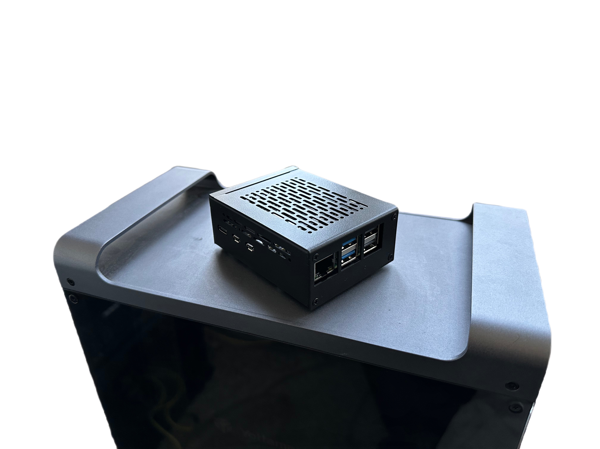

Links: 

- [Raspberry Pi 5](https://www.amazon.com/dp/B0CPWH8FL9?ref=ppx_yo2ov_dt_b_fed_asin_title&th=1)
- [Raspberry case](https://www.amazon.com/dp/B0D1JYTXSS?ref=ppx_yo2ov_dt_b_fed_asin_title)
- [Raspberry cooler](https://www.amazon.com/dp/B0D1JYTXSS?ref=ppx_yo2ov_dt_b_fed_asin_title)
- [Hdd enclosure](https://www.amazon.com/dp/B08G4489Z1?ref=ppx_yo2ov_dt_b_fed_asin_title)
- [WD red 6tb](https://www.amazon.com/dp/B0BDXQ61Z9?ref=ppx_yo2ov_dt_b_fed_asin_title&th=1)
- [WD blue 6tb](https://www.amazon.com/dp/B0BNGL4BND?ref=ppx_yo2ov_dt_b_fed_asin_title&th=1)
- [Seagate 8tb](https://www.amazon.com/dp/B07H289S7C?ref=ppx_yo2ov_dt_b_fed_asin_title&th=1)