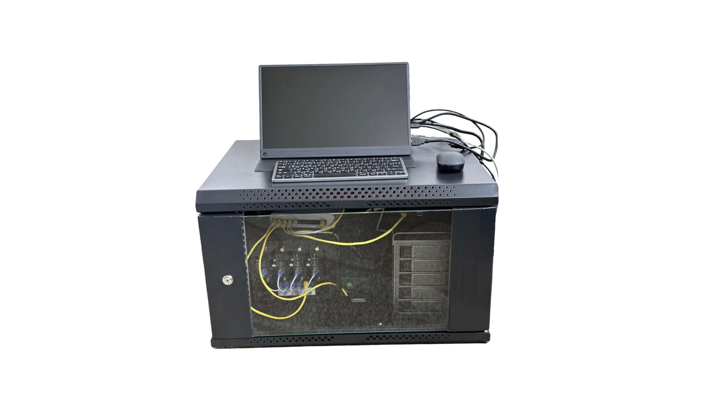
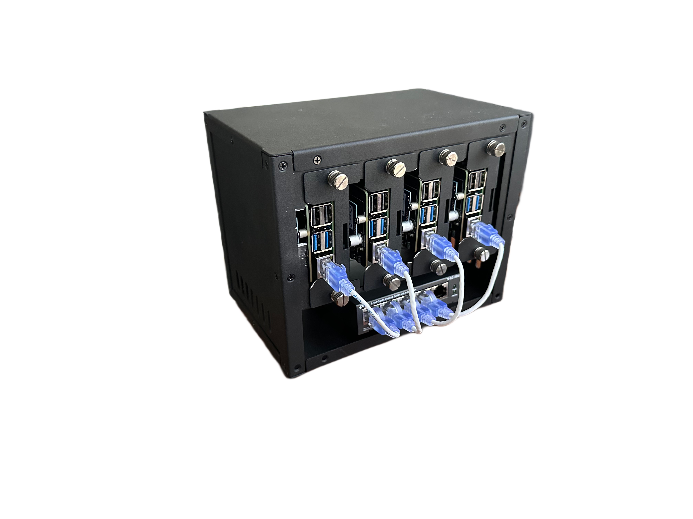
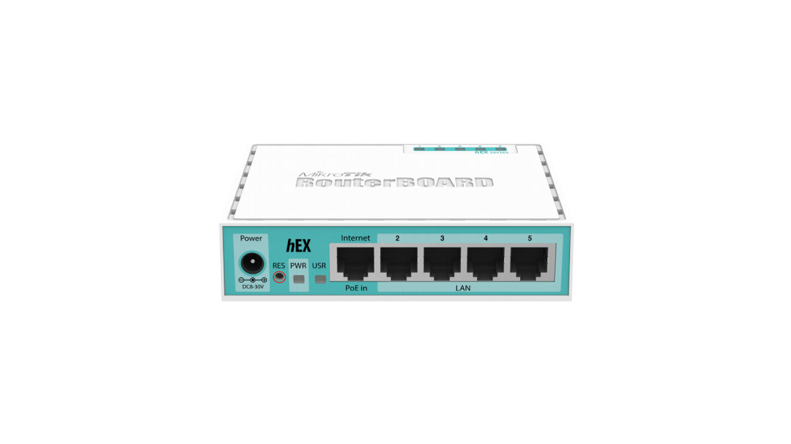
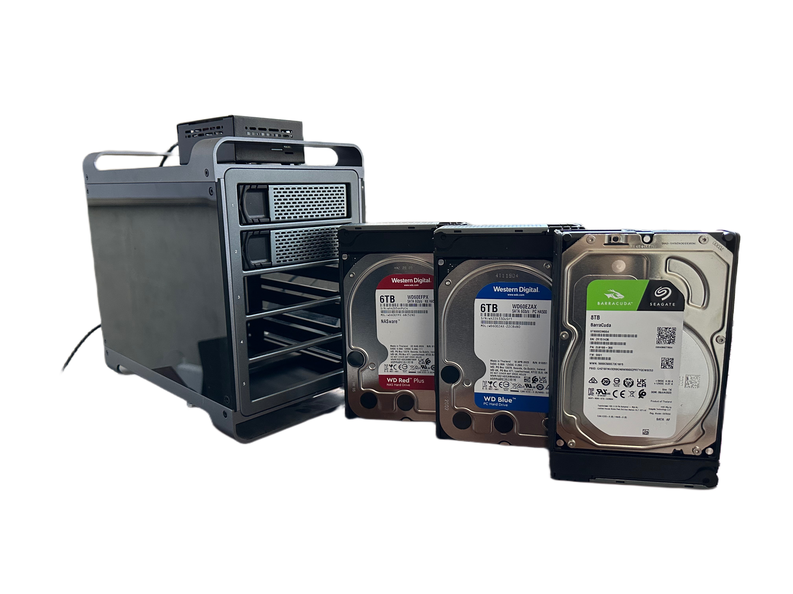
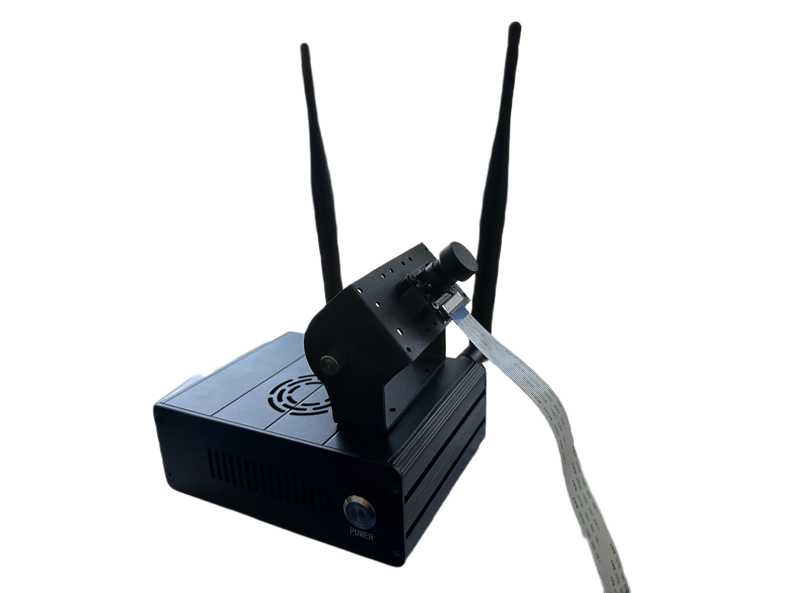
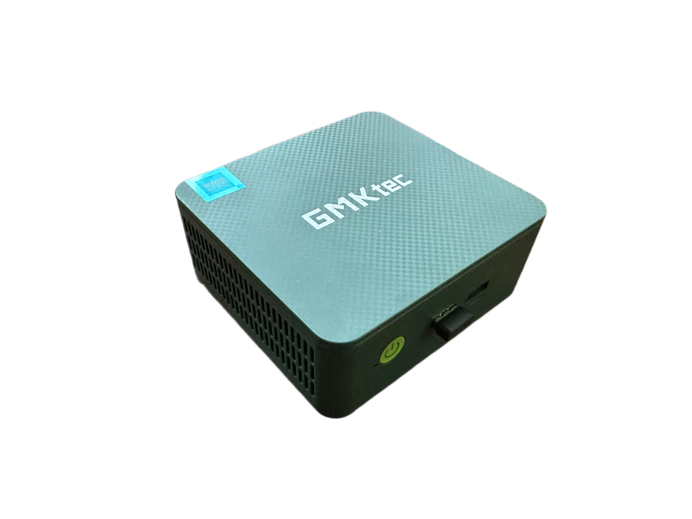

Links to the other blogs: 
- [NAS](https://surenpoghosyan.dev/blog/2024/nas/)
- [Rpi cluster](https://surenpoghosyan.dev/blog/2024/rpi-cluster/)
- [Jetson](https://surenpoghosyan.dev/blog/2024/jetson/)