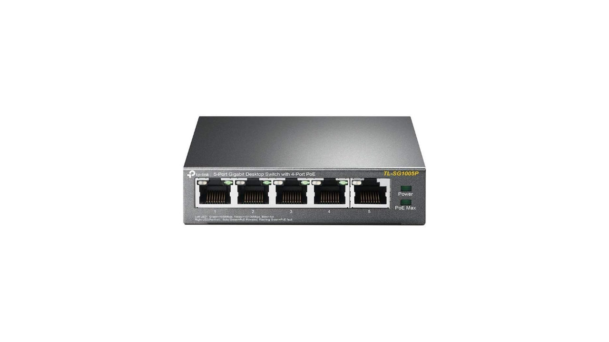

Links: 

- [Raspberry Pi 5](https://www.amazon.com/dp/B0CPWH8FL9?ref=ppx_yo2ov_dt_b_fed_asin_title&th=1)
- [Raspberry cooler](https://www.amazon.com/dp/B0D1JYTXSS?ref=ppx_yo2ov_dt_b_fed_asin_title)
- [Ethernet cables](https://www.amazon.com/dp/B07958H2ZB?ref=ppx_yo2ov_dt_b_fed_asin_title&th=1)
- [Case](https://www.amazon.com/dp/B09S11Q684?ref=ppx_yo2ov_dt_b_fed_asin_title)
- [POE hat](https://www.amazon.com/dp/B0D8JC3MXQ?ref=ppx_yo2ov_dt_b_fed_asin_title)
- [M2 ssd](https://www.amazon.com/dp/B0BBWH7DBT?ref=ppx_yo2ov_dt_b_fed_asin_title&th=1)
- [Switch](https://www.amazon.com/dp/B076HZFY3F?ref=ppx_yo2ov_dt_b_fed_asin_title)