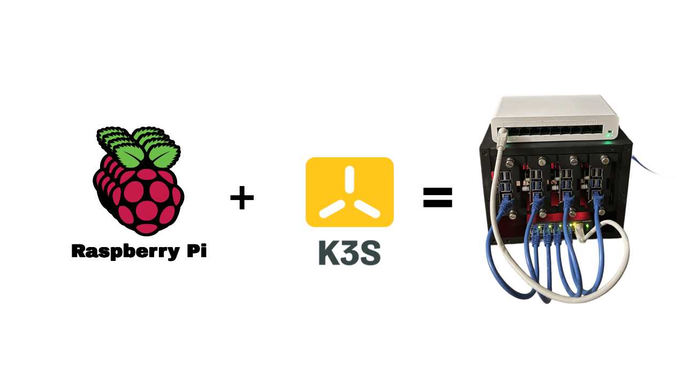
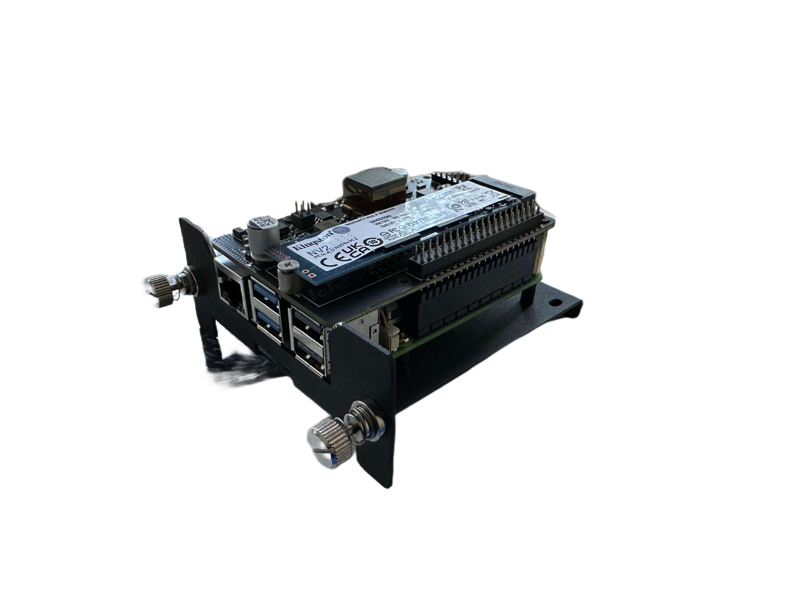
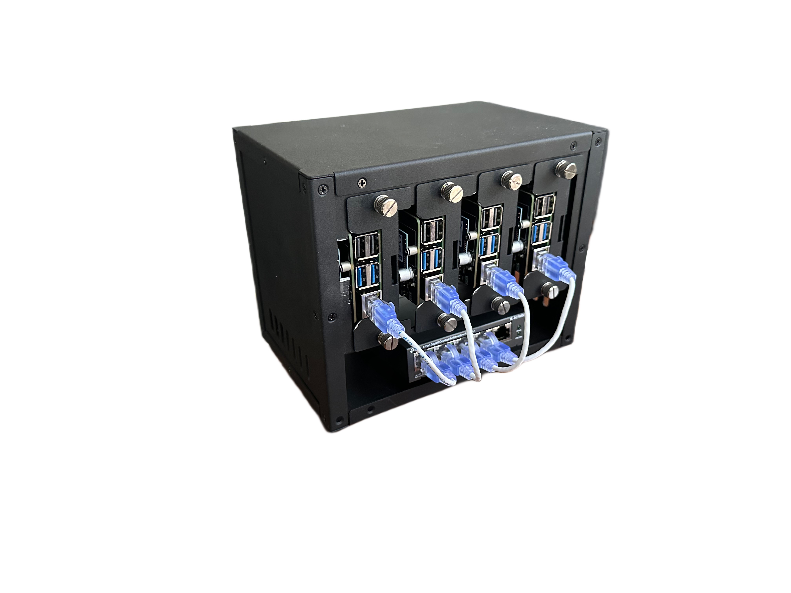
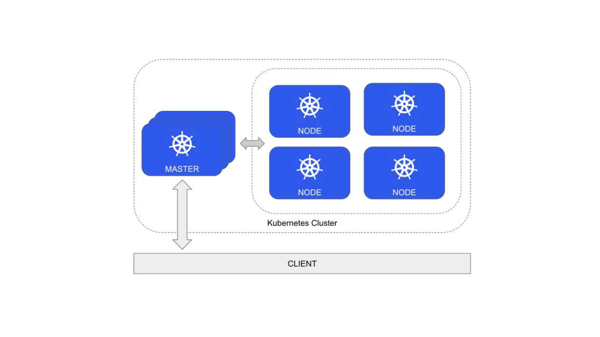

In this post, I’ll share my experience building a scalable distributed system using a Raspberry Pi 5 cluster and K3S. With this setup, I explored the world of distributed computing by connecting multiple Raspberry Pis to create a flexible, cost-effective solution for complex tasks. Whether you’re curious about clustering or need extra computing power, a Pi-based system like this offers many possibilities.

## Why Raspberry Pi and K3S?

Raspberry Pi 5 is a powerful yet affordable option for building a distributed system. It’s perfect for small-scale setups or experimenting with concepts like clustering. By running K3S, a lightweight version of Kubernetes, you get the benefits of container orchestration, which makes managing and scaling applications much easier.

K3S is designed specifically for environments with limited resources, so it fits well with Raspberry Pi hardware. It provides an efficient way to manage distributed systems without the complexity and overhead of a full Kubernetes setup.

## Hardware Setup

For this project, I used several key components:

-	**Raspberry Pi 5**: The core of the system.
-	**M2 SSDs**: For additional storage.
-	**POE and SSD Hats**: These made powering the Pis and connecting SSDs much easier.
-	**Ethernet Cables and a Switch**: To connect all the Pis together and ensure stable communication.
-	**Raspberry Pi Coolers**: For keeping the Pis cool during heavy workloads.

The hardware combination is affordable and scalable. You can start with a few Pis and expand as needed, adding more power and storage to handle larger workloads.

## Setting Up the Cluster

Setting up a Raspberry Pi cluster with K3S doesn’t require you to be a Kubernetes expert, but it does help to understand how distributed computing works. A cluster is essentially a group of connected devices (in this case, Raspberry Pis) that work together as one system. This allows you to divide tasks across multiple nodes, making it easier to handle heavy workloads or multiple applications at once.

The general idea is to designate one Pi as the master node, which coordinates the other worker nodes in the cluster. The worker nodes handle most of the actual work, whether it’s processing data, running applications, or storing information.

Once your cluster is set up, K3S distributes workloads across the nodes, automatically balancing the tasks based on available resources. This approach improves both performance and fault tolerance. If one Pi goes offline, the rest of the cluster continues operating.

## Advantages of Using a Raspberry Pi Cluster

One of the biggest advantages of using Raspberry Pis is that they are affordable. If you need more power, you can simply add more Pis to your cluster without a huge upfront investment. This makes them ideal for experimenting with scalability or handling small to medium-scale applications.

If you want to learn more about Kubernetes or distributed computing, this setup is a great starting point. K3S simplifies many of the complex aspects of Kubernetes, allowing you to focus on learning how to deploy and manage applications across a cluster.

## Best Practices and Advice

While building a Raspberry Pi cluster isn’t overly complicated, there are some best practices and things to keep in mind...

Make sure your Pis are connected via **reliable Ethernet cables** and a **high-quality switch**. Network issues can disrupt communication between nodes, affecting the performance of your distributed system.

Raspberry Pis, especially when clustered, **can get quite warm** during extended use. Using coolers helps to maintain optimal performance. Also, using Power over Ethernet (POE) can reduce clutter by eliminating the need for separate power adapters.

Adding **M2 SSDs** provides faster storage compared to microSD cards, which is essential when running applications or storing data in a distributed system. Using SSDs ensures faster read/write speeds, better reliability, and overall improved performance.

If you’re using **K3S** to manage workloads, make sure you set up persistent volumes for your applications. This allows your containers to access data from the SSDs, ensuring that important data isn’t lost when containers restart or are moved between nodes.

You don’t need to set up a huge cluster from the beginning. **Start with a small setup** (maybe 2 or 3 Pis), and expand as you get more comfortable with distributed computing concepts. Over time, you can add more Pis, more storage, and experiment with more complex workloads.

## Use Cases

A Raspberry Pi cluster like this can be used for a variety of purposes:

-	**Learning distributed systems**: It’s a perfect environment for understanding how distributed systems work in practice.
-	**Running containerized applications**: With K3S, you can deploy applications that need to scale automatically.
-	**Hosting web services**: You could use your cluster to host small-scale web services, APIs, or even websites.
-	**Data processing**: If you have tasks that require parallel processing, such as analyzing datasets, the cluster can distribute the load and process data more efficiently.

## Conclusion

Building a scalable distributed system with Raspberry Pis and K3S was an exciting challenge and a great learning experience. This project taught me a lot about Kubernetes, distributed computing, and the flexibility of a Pi-based system. Whether you’re looking to experiment or need a cost-effective way to boost processing power, this setup offers a lot of potential.

I hope this overview gives you an idea of how you can build your own Raspberry Pi cluster. It’s a fun, educational project that has practical applications. 

Links: 

- [Raspberry Pi 5](https://www.amazon.com/dp/B0CPWH8FL9?ref=ppx_yo2ov_dt_b_fed_asin_title&th=1)
- [Raspberry cooler](https://www.amazon.com/dp/B0D1JYTXSS?ref=ppx_yo2ov_dt_b_fed_asin_title)
- [Ethernet cables](https://www.amazon.com/dp/B07958H2ZB?ref=ppx_yo2ov_dt_b_fed_asin_title&th=1)
- [Case](https://www.amazon.com/dp/B09S11Q684?ref=ppx_yo2ov_dt_b_fed_asin_title)
- [POE and SSD hat](https://www.amazon.com/dp/B0D8JC3MXQ?ref=ppx_yo2ov_dt_b_fed_asin_title)
- [M2 SSD](https://www.amazon.com/dp/B0BBWH7DBT?ref=ppx_yo2ov_dt_b_fed_asin_title&th=1)
- [Switch](https://www.amazon.com/dp/B076HZFY3F?ref=ppx_yo2ov_dt_b_fed_asin_title)